import "./images.css"

## Elements 

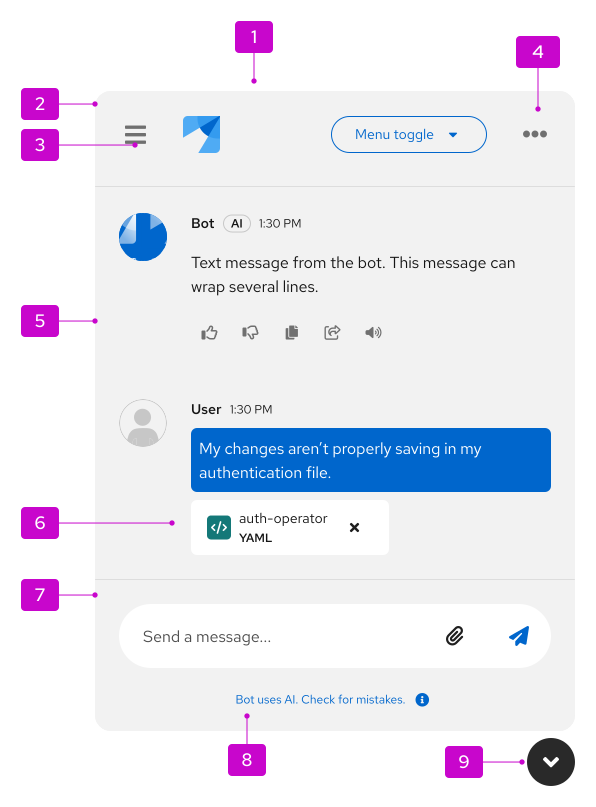

1. **Container:** The window that contains the entire ChatBot experience and all of its components.
1. **Header:** A persistent region at the top of the ChatBot window that contains navigation, branding, and actions.
1. **History menu:** A menu that contains a conversation history of previous chats.
1. **Options menu:** A menu that contains settings that are relevant to your product. This typically includes display options (more details in the [ChatBot variations section](#variations)) and other general settings (more details in the [ChatBot settings and preferences section](#chatbot-settings-and-preferences)).
1. **Messages:** Elements of the conversation between a ChatBot and user. More details can be found in the [message guidelines](#messages).
1. **Attachments:** Details about files that a user has uploaded to the ChatBot.
1. **Footer:** A persistent region at the bottom of the ChatBot window that contains the message bar and the footnote.
1. **Footnote (optional):** A persistent, short message that contains any legal disclaimers or important information about the ChatBot. Footnotes are optional, but strongly recommended. More details can be found in the [footnote guidelines](#footnotes).
1. **Toggle:** The button that allows users to open and close the ChatBot window. When the ChatBot is opened, the toggle should appear below the ChatBot window. The toggle shape and icon can be customized as needed, as shown in these [ChatBot toggle examples](/patternfly-ai/chatbot/ui#custom-toggle-icon). More details can be found in the [guidelines for accessing a ChatBot](#accessing-a-chatbot).

### Messages

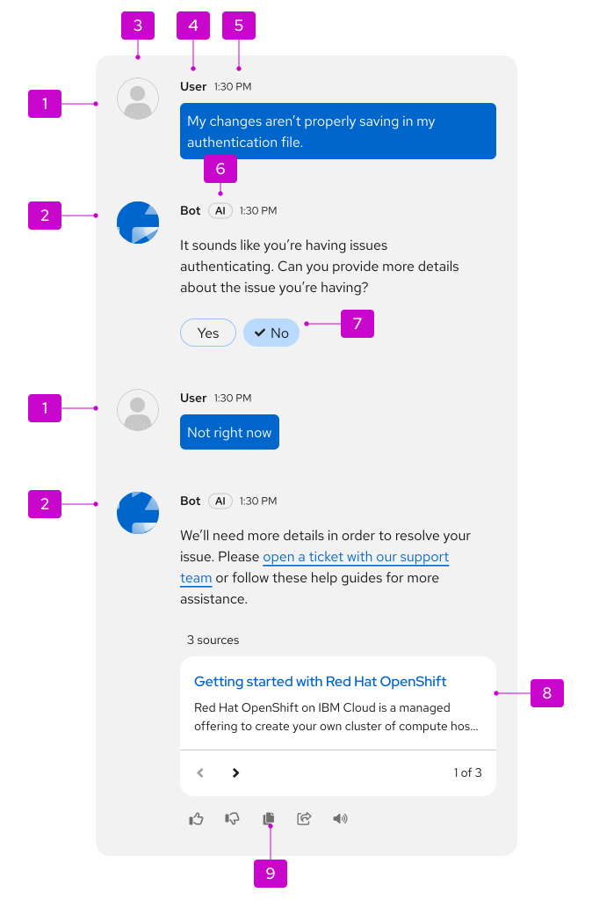

1. **User message:** Messages that the user has sent to the ChatBot.
1. **Bot message:** Messages from the ChatBot, which are marked with an "AI" label to communicate the use of AI to users. You should choose a descriptive name for your ChatBot.
1. **Avatar:** Representative image for your ChatBot and the user. ChatBot avatars should align with your product's brand and any existing brand standards.
1. **Name:** Identifier for your ChatBot and the user. Choose a name for your ChatBot that users can easily identify as a bot.
1. **Timestamp:** The relative or absolute time that a message was sent.
1. **Label:** Labels ChatBot messages as "AI."
1. **Quick responses:** Programmable, clickable actions that allow users to quickly answer questions from the ChatBot.
1. **Message actions:** Actions that allow users to interact with a bot message. These typically include providing feedback, copying, sharing, or reading aloud, but [custom message actions](/patternfly-ai/chatbot/messages#custom-message-actions) are also supported. More details for the feedback actions can be found in the [message feedback](#message-feedback) section.

#### Welcome message

At the start of a new chat, you should welcome your users to the ChatBot with a greeting.

If you have user details from their account information, you can personalize this greeting with their username or name. If you don't have this information, or if you'd prefer to not use their personal details, you should instead introduce the ChatBot: 

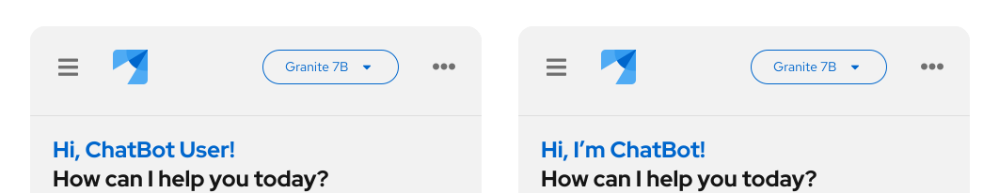

To help users get started quickly, it can also be helpful to include welcome prompts. When selected, these prompts will become the user's first message to the ChatBot, which the bot will immediately begin to reply to. To avoid overloading your users, present no more than 3 prompts at a time.

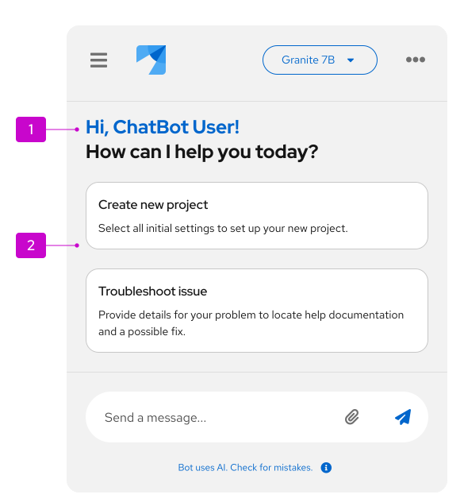

#### Source tiles

A ChatBot can share relevant sources with users, like documentation that could provide the information a user is searching for. These sources will be contained in a single tile, which users can paginate through and select to navigate to other resources. 

To provide users with enough context, sources should have descriptive titles and descriptions. The title is limited to 1 line and the body is limited to 2 lines.

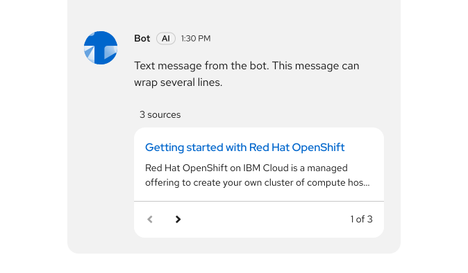

#### Quick start tiles

A ChatBot can share a link to a [quick start](/extensions/quick-starts) that will help users complete a given task. Users can either select **Start** or the tile's title to initiate the linked quick start.

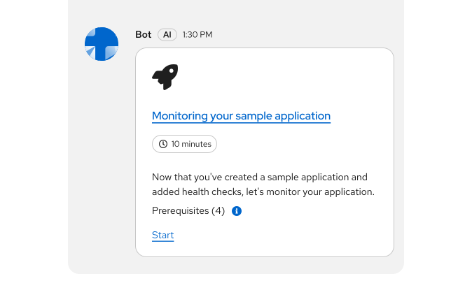

Selecting the quick start title, or the "Start" link can be configured to launch the quick start in a new window, as an interactive bot conversation within the ChatBot window, or as a separate tab within the ChatBot drawer (as shown in this [quick start/ChatBot concept demo](https://quickstart-chatbot-demo.surge.sh/?quickstart=install-app-and-associate-pipeline)).

### Message actions 

To allow users to interact with bot messages, utilize message actions. Refer to [the message actions React example](/patternfly-ai/chatbot/messages#message-actions) for an interactive visual.

The following actions can be used for some of the most common interactions:

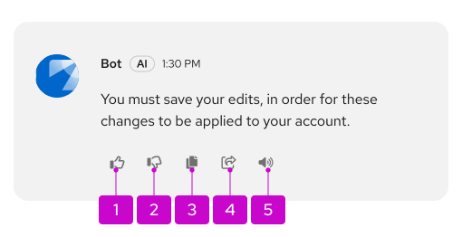

1. **Feedback (good response):** Applies a positive rating to the message.
1. **Feedback (bad response):** Applies a negative rating to the message.
1. **Copy:** Copies the message content to the clipboard.
1. **Listen:** Reads the message content out loud.

You can also use [custom message actions](/patternfly-ai/chatbot/messages#custom-message-actions) as needed for your particular use case. When using custom actions, be sure to add a tooltip that describes the effect that the action will have. For more information, view [our tooltips guidelines](/ux-writing/tooltips). 

#### Message feedback

A commonly used message response action is rating, which allows users to give feedback on the quality or helpfulness of a bot message. These actions include a thumbs-up icon, for a positive rating, and a thumbs-down icon, for a negative one:

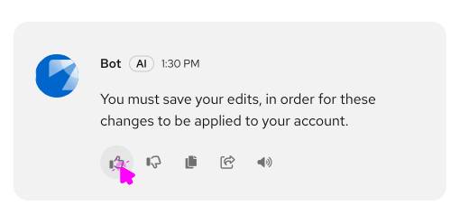

When users select either of these icons, you should present them with either:

1. A thank-you card that confirms a user's response was received. Even if you don't use a feedback form, you should still display the thank-you card, so that users can be confident their rating went through.
 
 
    

    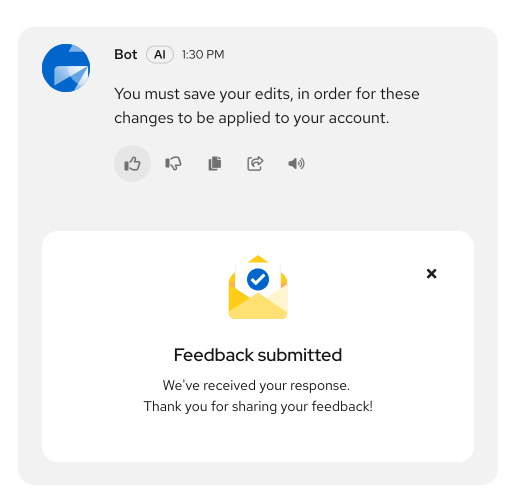
    

1. A feedback form that collects more details.
 
 
    

    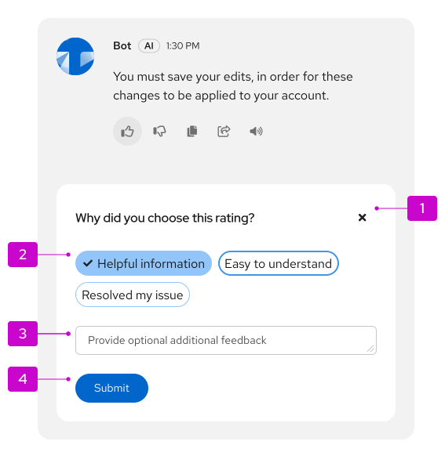
    

    1. **Close button (optional):** Closes the feedback form. The original feedback response should still be collected.
    1. **Quick responses:** Options for users to provide more context around their rating. Customize these to make the most sense for your product. You can present positive and negative options based on the response type originally selected.
    1. **Text area (optional):** Allows users to provide additional written detail if they'd like.
    1. **Submit button:** Submits the feedback form and triggers the   thank-you card.

### Message bar

To message the ChatBot, users can type directly into the message bar in the footer or click any included actions.

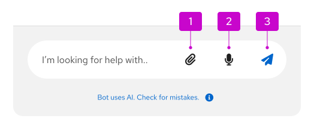

1. **Attach button:** Allows users to upload files from their computer.
1. **Use microphone button:** Supports speech recognition to allow users to use voice input. This feature is currently only available in Chrome and Safari.
1. **Send button:** Allows users to send a typed message. This button should be disabled until a user has input text.

When a user chooses to use speech input via the microphone button, the button will display a pulsing animation to indicate that the ChatBot is listening to the user (as shown in [this speech recognition example](/patternfly-ai/chatbot/ui#message-bar-with-speech-recognition-and-file-attachment)).

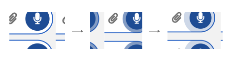

When a bot is responding (or "streaming") to the user, a stop button will be displayed as the only action in the message bar. Selecting this button will halt the bot's message where it's at.

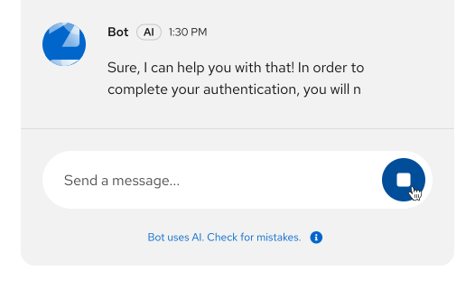

### Footnotes

The footnote provides a persistent space to display messaging about your product's Terms and Conditions, which focus on the rules of using the service, and Privacy Policy, which focuses on the handling of personal data.

Though footnotes are not required, they are highly recommended to ensure legal compliance, establish user trust, and clearly define the usage guidelines and data handling practices.

When users select the footnote, you can display a popover that provides more information than would fit in the footnote:

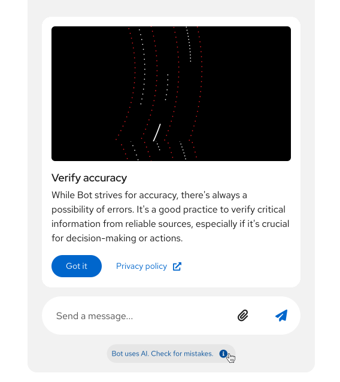

## Usage

When ChatBots are designed to meet the needs of your users, they can improve the overall UX of your product by offering convenient, efficient, and persistent support. When your ChatBot cannot find an answer for your users, you must provide them with a method to contact human support.

Before building a ChatBot, make sure that you have justified it as an appropriate solution by asking yourself these questions:

- What are the users’ goals?
- How in-depth is the assistance the user will need?
- Does human assistance better serve your users?
- How is a ChatBot superior to online documentation, contextual support or wizards?
- What data sources or abilities can this ChatBot leverage to assist your users?

Do not create a ChatBot simply for the sake of novelty.

### When to use a ChatBot

Use a ChatBot to offer your users on-demand help at any time, including:

- Technical support and troubleshooting.
- Product information and documentation.
- Sales and product recommendations.
- Training and onboarding.
- System monitoring and alerts.
- Community engagement.
- Feedback collection and surveys.

### When not to use a ChatBot

Do not use a ChatBot when:

- A task could be accomplished more efficiently through the UI.
- A process is very complex or could take a long time.
- A real human is needed for sensitive or emotional topics.

## Behavior

### Accessing a ChatBot

The ChatBot toggle is the access point for users&mdash;place it in either of the following UI locations: 
- **Floating toggle:** Consistently located in the bottom-right corner of the screen, this persistent button overlays other page content. Use if a masthead toggle would overcomplicate a masthead that already has many utilities.
- **Masthead toggle:** A button that's integrated as a masthead utility. Use this location if a floating toggle would obscure important content.

To help users further identify the toggle, add a "Launch ChatBot" tooltip. You can swap "ChatBot" in the tooltip for your bot's unique name.

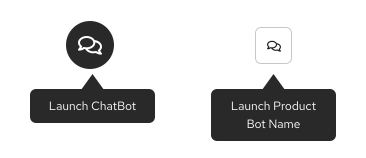

Whichever method you choose, it is critical to be consistent with the toggle location and refer to the following the additional guidelines for each. 

#### Floating toggle
When users click the toggle, the ChatBot window opens and the toggle will change to display an "angle down" icon to indicate that clicking the toggle again will minimize the ChatBot. Users can select the toggle at any point in their journey to open and close the ChatBot as needed.

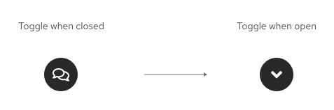

When there is an unread message from the ChatBot, a notification badge should be placed on the toggle.

If necessary for brand consistency, you can customize the toggle shape and icon.

#### Masthead toggle 

When the ChatBot toggle is a masthead utility, use the fa-comments icon:

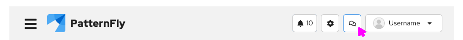

The exception to this is if you have a specific icon that aligns with your product or ChatBot branding.

When there is an unread message from the ChatBot, a notification count should be displayed, and the badge should be styled as unread.

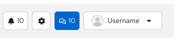

### Launching a ChatBot from page content

If a UI element within the page content is an AI/ChatBot-supported feature, the ChatBot should be launched when users select the clearly-identified action. These kinds of actions should display your ChatBot's logo beside a label that clearly communicates the intention of the AI action.

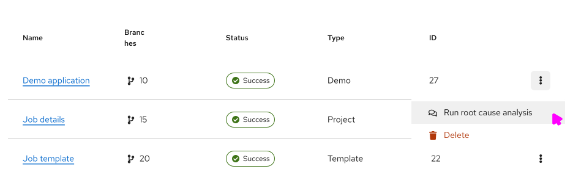

When a ChatBot is launches via an AI-supported action, the action should be sent as a user message once the ChatBot opens.  

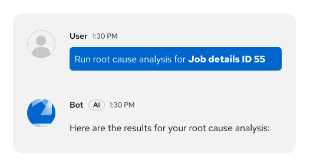

### Starting a new conversation 

Each time a user begins a new conversation, display a [welcome message, with prompts](#welcome-message) that help them learn what the ChatBot can help with.

As much as possible, the suggested prompts should consider the user’s location in the service or application, or the situation their project is undergoing. 

### Using the conversation history menu

The ChatBot history menu contains a log of a users' previous chats. Clicking the menu icon opens a side drawer in the ChatBot window.

By clicking into the history menu, users can search through previous conversations and perform additional actions, such as sharing a conversation with others.

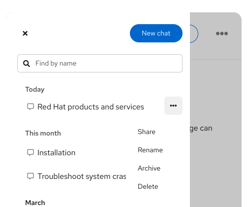

When the conversation history is still loading, display skeleton items:

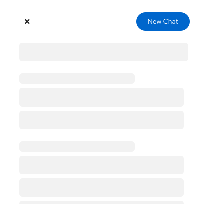

If there's an error loading the conversation history, display an error screen with steps for resolving the error:

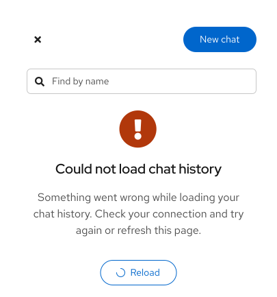

### ChatBot settings and preferences

Users can access ChatBot settings and preferences via the options menu.

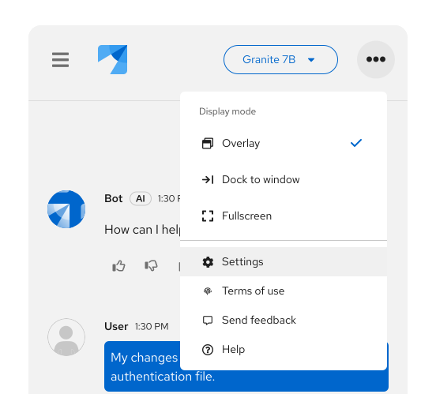

Within the settings menu, users can select their preferences for a variety of ChatBot features, like theme or language. You can also support additional content management here, like adding or deleting chats. This menu can be customized to meet the needs of your ChatBot's users.

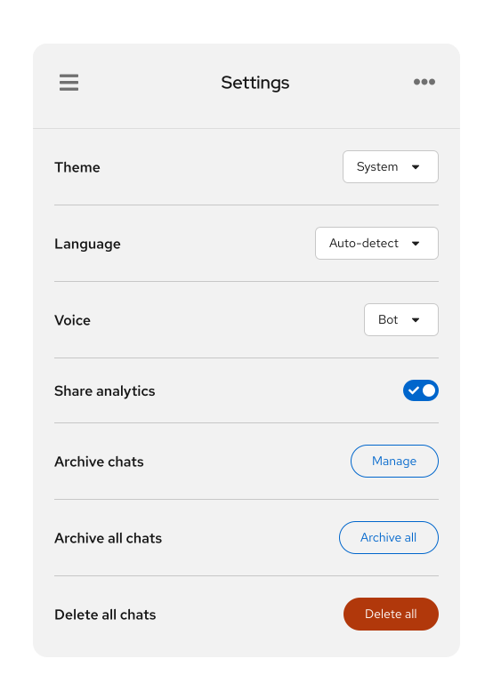

### Attaching files

Using [the attach button](/patternfly-ai/chatbot/overview/design-guidelines#message-bar) in the message bar, users can [attach files](/patternfly-ai/chatbot/messages#file-attachments) to their message to share with the ChatBot.

The attach button can follow a couple of patterns, including:

- Opening the file explorer for a user's operating system
- Opening a menu with attachment options that are chosen by designers and developers

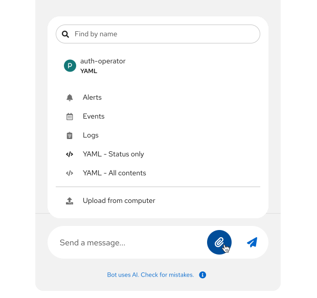

When users attach a file to a message that they're drafting, it will be displayed in the ChatBot footer, above the message bar. This allows them to remove an attachment before sending if necessary:

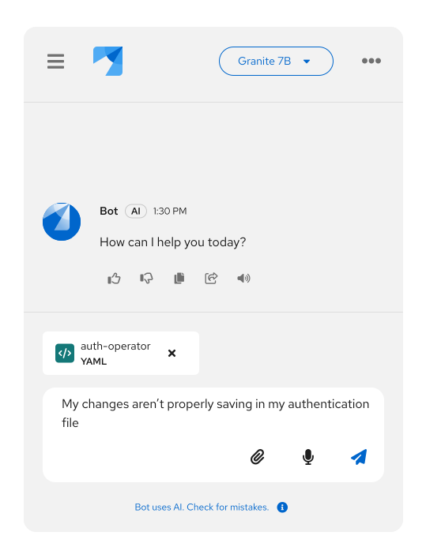

If a message attachment is successful, a label with the file details will be displayed in the message:

Users can select the file label to either preview or edit their attachment, as shown in these [attachment examples](/patternfly-ai/chatbot/messages#attachment-preview).

If a message attachment fails, an error message should share the reason for failure:

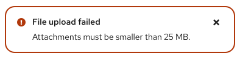

## Variations

### Display modes

There are a few display modes that users can choose when interacting with a ChatBot.

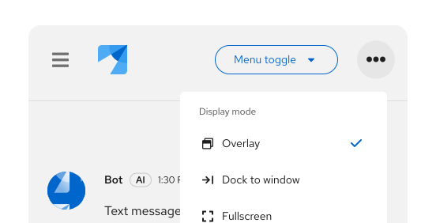

1. **Overlay:** The default display mode, which floats the ChatBot window on top of a product's UI. In overlay mode, the ChatBot can be opened and minimized with the toggle.

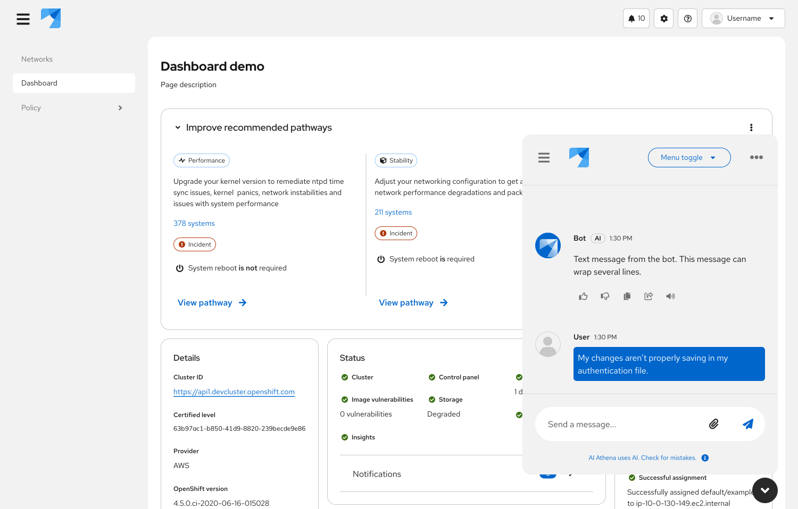

2. **Docked:** Anchors the ChatBot to the side of the page, on top of the page content. 

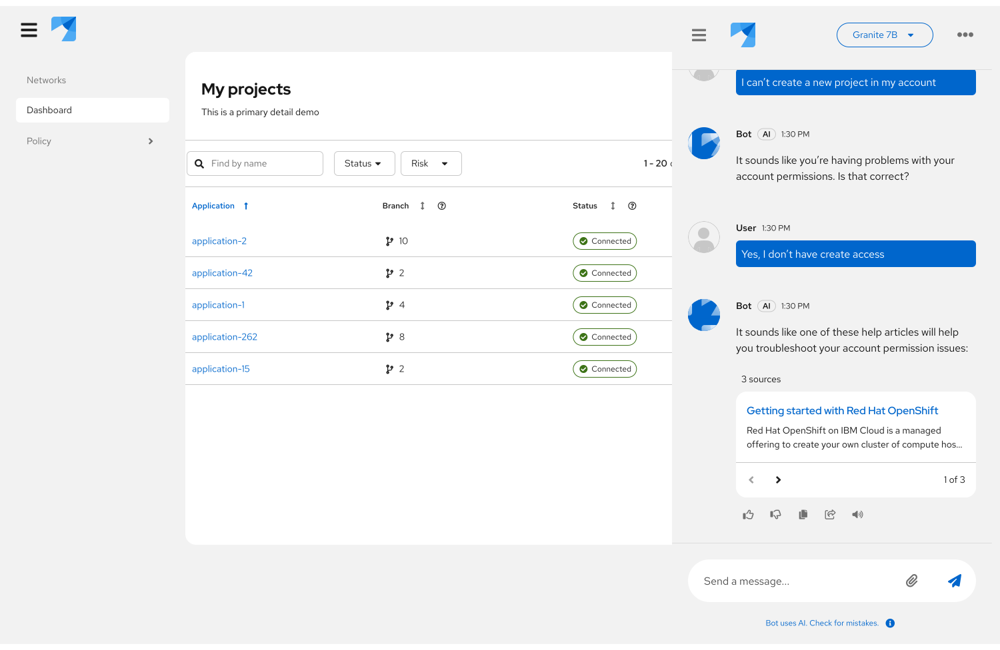

3. **Embedded:** Places the ChatBot within a product as its own page. An embedded ChatBot could be displayed in the product's navigation menu.

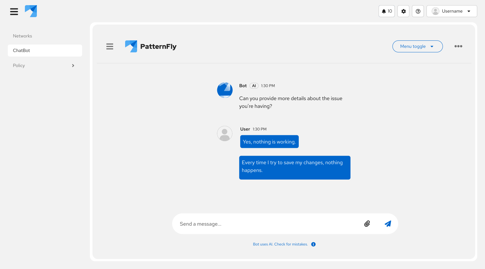

4. **Full screen:** Fills the screen with the ChatBot window.

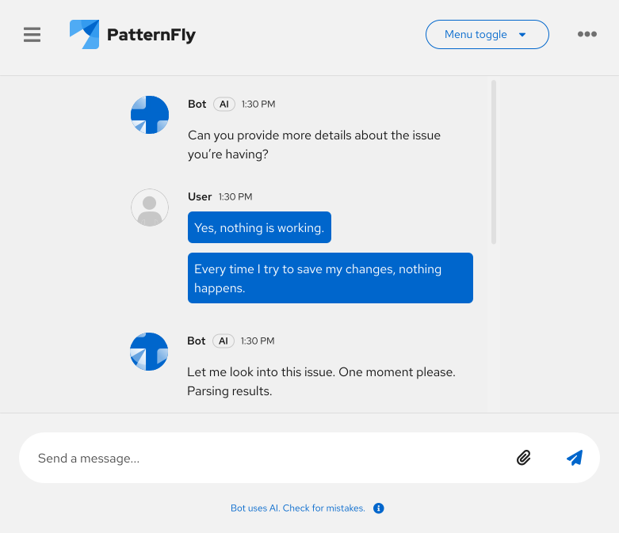

5. **Inline drawer**: A ChatBot that can fit and perform within a drawer. This drawer can look different for each product, but will often be placed to the side of the page, inline with the page content.

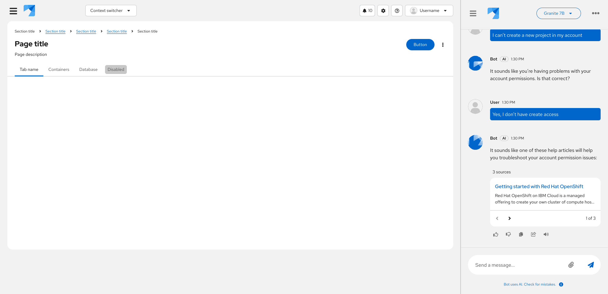

### Layouts

ChatBot supports a side-by-side [comparison layout](/patternfly-ai/chatbot/overview/demo#comparing-chatbots), which allows users to compare 2 chats at once. This can be helpful to let users understand how different models respond to the same prompt.

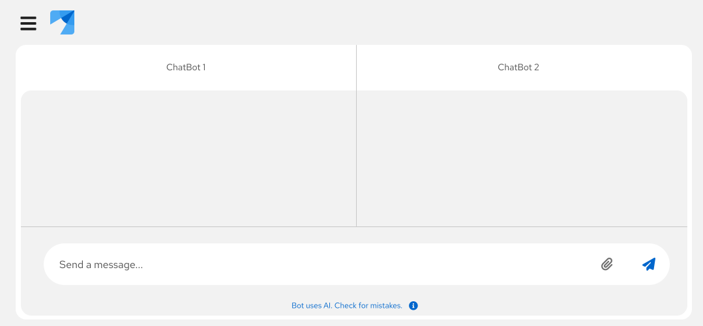

## Placement

Your users will expect your ChatBot to be in a reliable, permanent location. Overlay displays are placed in the bottom right of the screen by default. If you're using a full screen or embedded ChatBot, stick to a consistent access location, like a button in the masthead or an item in the navigation menu.

Refer to the additional guidelines for [accessing a ChatBot](#accessing-a-chatbot).

## Content considerations

For guidance on writing ChatBot content, refer to our [conversation design guidelines](/patternfly-ai/conversation-design).

## Accessibility

Although accessibility has been integrated into the design of our ChatBot components, it is important to ensure that your implementation is inclusive of all users. For more guidance, refer to [our accessibility guidelines](/accessibility/about-accessibility).
