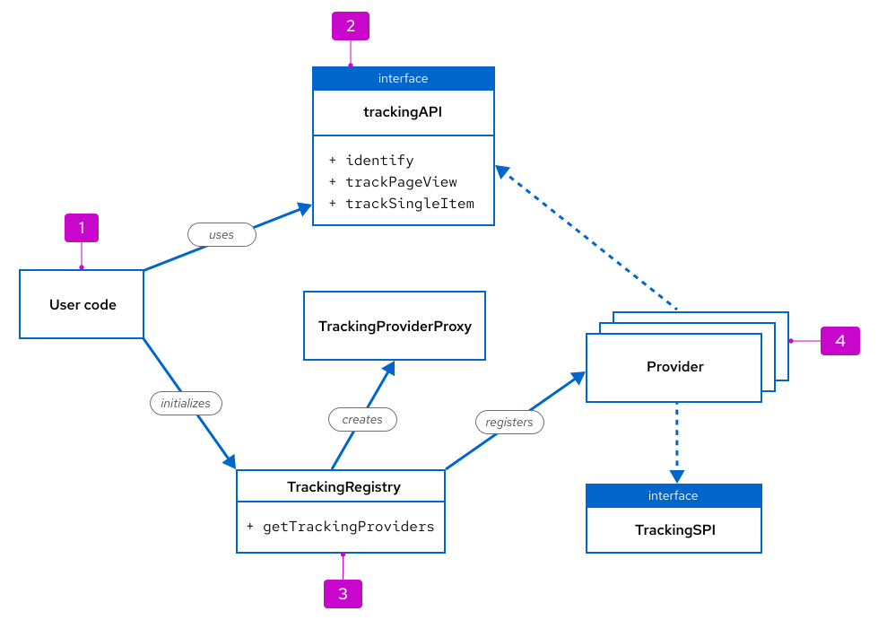
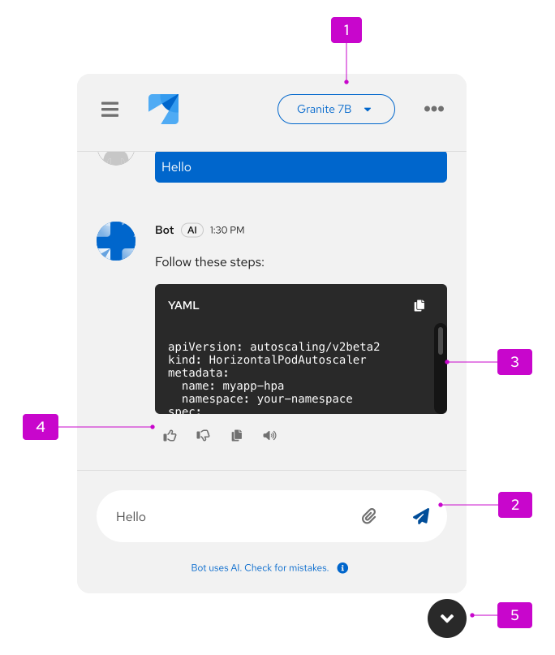
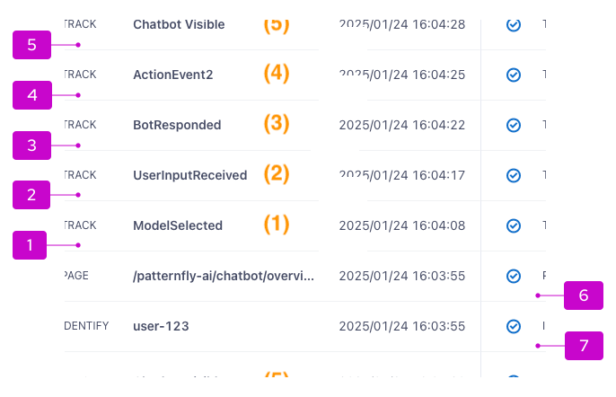
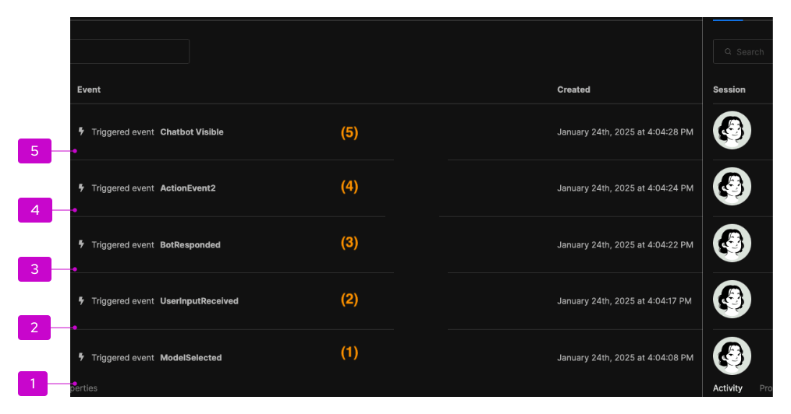
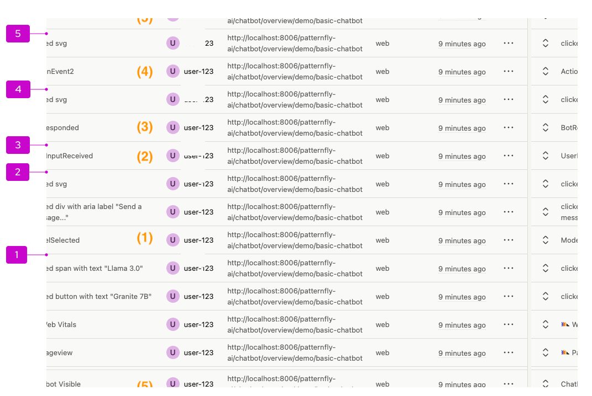

---
# Sidenav top-level section
# should be the same for all markdown files
section: PatternFly-AI
subsection: ChatBot
# Sidenav secondary level section
# should be the same for all markdown files
id: Analytics
source: Analytics
# Tab (react | react-demos | html | html-demos | design-guidelines | accessibility)
# If you use typescript, the name of the interface to display props for
# These are found through the sourceProps function provided in patternfly-docs.source.js
sortValue: 4
---
import "../../images.css"

To gain more insight into the ways that your users interact with your ChatBot, you can add support for **analytics**. To add analytics tracking, you can refer to this guide and configure tracking for the interactions you care about most.   

## Elements

This following diagram shows the main components of ChatBot analytics tracking code, as well as the flow of information between components:

<div class="ws-docs-content-img">

</div>

The user code (1) first calls the static `getTrackingProviders()` method (3) which initializes the tracking providers (4). This returns an instance of the `trackingAPI` (2), which can then subsequently be used to emit analytics events.

Note that user code only interacts with:
- `trackingAPI` (including `identify`, `trackPageview`, `trackSingleItem`)
- `TrackingRegistry` (including `getTrackingProviders`)

## Usage

### Setup

1. Before you can use the `trackingAPI`, you must first supply the API keys of the respective providers. 

  ```nolive
  const initProps: InitProps = {
    segmentKey: 'TODO-key', // TODO add your key here
  //  segmentCdn: 'https://my.org/cdn',  // Set up segment cdn (optional)
  //  segmentIntegrations: { // Provide Segment integrations (optional)
  //          'Segment.io': {
  //            apiHost: 'my.api.host/api/v1',
  //            protocol: 'https'
  //          }
          },

    posthogKey: 'TODO-key',
    umamiKey: 'TODO-key',
    umamiHostUrl: 'http://localhost:3000', // TODO where is your JS provider?
    something: 'test',
    console: 'true' // Console provider
  };
  ```

1. Once this is done, you can create an instance of the `trackingAPI` and start sending events.

    ```nolive
    const trackingAPI = getTrackingProviders(initProps);
    ```

1. One of your first events should identify the user in some way, such as a UUID that stays consistent for the same user. 

  ```nolive
  const trackingAPI = getTrackingProviders(initProps);
  trackingAPI.identify('user-123'); // TODO get real user id
  // Track the page that is currently visited. Best put into a react effect (see below)
  trackingAPI.trackPageView();
  // Track a single Event
  trackingAPI.trackSingleItem("MyEvent", { response: 'Good response' })
  ```

#### Tracking providers

Only providers with a matching key in the `InitProps` will be started and used.

```nolive
const initProps: InitProps = {
  segmentKey: 'TODO-key', // TODO add your key here
  posthogKey: 'TODO-key',
  umamiKey: 'TODO-key',
  umamiHostUrl: 'http://localhost:3000', // TODO where is your JS provider?
  console: true
```

##### Modifying providers 

If you know upfront that you only want to use 1 of the supported providers, you can modify `getTrackingProviders()` and remove all other providers in the providers array.

When using the providers you need to add additional dependencies to your package.json file:

```nolive
"dependencies": {
  "@segment/analytics-next": "^1.76.0",
  "posthog-js": "^1.194.4"
```

##### Adding providers

To add another analytics provider, you need to implement 2 interfaces, `TrackingSpi` and `trackingApi`.
1. It is easiest to start by copying the `ConsoleTrackingProvider`
1. The first thing you should do is to provide a correct value in `getKey()`
1. Once you are happy enough with the implementation, add it to the array of providers in `getTrackingProviders()`

### Page flow tracking

To understand how users move through their ChatBot journey, you can track their page flow. 

To add tracking to each page view, use the `trackPageView()` method.

```nolive
import React from 'react';
import { useLocation } from 'react-router-dom';

export const useTrackPageFlow = (): void => {
  const { pathname } = useLocation();

  // notify url change events
  React.useEffect(() => {
    trackingAPI.trackPageView();
  }, [pathname]);
};
```

### Event tracking

To get more specific insight into how users are interacting with the UI, you can track single events, including button clicks, form submissions, and so on. 

To add tracking to an interaction of your choice, use the `trackSingleItem` method.

```nolive
trackingAPI.trackSingleItem(eventName, propertyDict)
```

This method takes 2 parameters:
- `eventName`: The unique name of the event. To differentiate different events that use the same name, you'll need to add an additional property.
- `propertyDict`: A dict with key-value pairs that represent important properties of the event. If there are none, this value can be empty.

#### Form submissions

Only add tracking to the form itself, not the button that opens the form. You should track both successful and failed form submissions, as well as cancelled forms

```nolive
trackingAPI.trackSingleItem(Event_Name, {
    outcome: << submit , cancel >>,
    success? : boolean,
    error? : string,
    <properties>, string/number/boolean } )
```

Parameters to pass with the `trackSingleItem` method can include:
- `outcome`: Communicates if the form was submitted or cancelled. 
- `success`: Used for a "submit" outcome to communicate if the submission was successful for not in the backend.
- `error`: Used for a "submit" outcome to communicate the error message associated with a failed submission. Try to remove extraneous parts of the message, like part of a container-name.
- `properties`: Any additional properties from the form, to be tracked for analytics. 
  - Use your judgement to determine what will be useful for your analytics.
  - Highly specific data, like names provided by the user or description text input, should not be tracked. 
  - Less personal data, like deployment replica count or memory server size, is more likely to help you understand your users.

## Examples

To better understand the analytics tracking process, here are 3 examples of what you could see in an analytics tool.

For all 3 tools, consider the following example, where the users has started a ChatBot and taken actions 1-5 in order:

<div class="ws-docs-content-img" style="width:60%">

</div>

1. Selected a model
2. Sent a question
3. Received a response from the model
4. Clicked the "thumbs up" button
5. Closed the ChatBot window

This pattern of actions will be applied to the following 3 analytics tools.

1. Segment

    - [Segment](https://segment.com/) shows all user events in its source debugger: 

      <div class="ws-docs-content-img" style="width:70%">
      
      </div>
    
      - 1-5: User actions with the newest event at the top.
      - 6-7: You can also see the results of `identify` (6) and `trackPageView` (7).
      - If you clicked on an event, you would also see the properties.

    - **Note**: When using the Segment provider, you may also want to set the `segmentCdn` and `segmentIntegrations` initialization properties.

1. Umami

    - In [Umami](https://umami.is/), events are visible within **Website** / **Events**.
    - The list is similar to Segment, with different formatting:

      <div class="ws-docs-content-img">
      
      </div>

      - 1-5: User actions with the newest event at the top.

3. PostHog

    - In [PostHog](https://posthog.com/), events are located in the **Activity** section. 
    - PostHog integrates deeper in the provided code, so there are more default events tracked:

      <div class="ws-docs-content-img">
      
      </div>

      - 1-5: User actions with the newest event at the top.