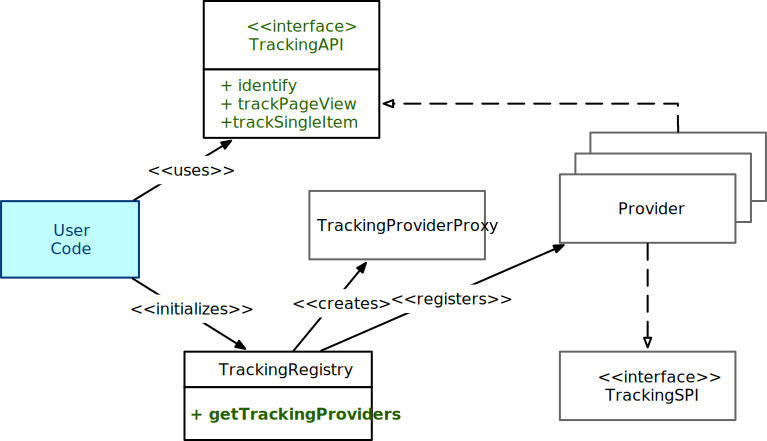

---
# Sidenav top-level section
# should be the same for all markdown files
section: PatternFly-AI
subsection: ChatBot
# Sidenav secondary level section
# should be the same for all markdown files
id: Analytics
# Tab (react | react-demos | html | html-demos | design-guidelines | accessibility)
source: react
# If you use typescript, the name of the interface to display props for
# These are found through the sourceProps function provided in patternfly-docs.source.js
propComponents: []
sortValue: 4
---

import eventsSegment from './Events_Segment.png';
import eventsUmami from './Events_umami.png';
import eventsImg from './Events.png';
import eventsPosthog from './Events_posthog.png';

## Overview

The following diagram shows the main components of the Analytics tracking code:

<div class="ws-docs-content-img">

</div>

The user code first calls the static `getTrackingProviders()` method which initialises the tracking providers.
This returns an instance of the `TrackingAPI` , which can then subsequently be used to emit analytics events.

User code (blueish box) only interacts with the classes/methods in green.

## Usage

Before the code can be used, it is necessary to once supply the api-keys of the respective providers:

```nolive
const initProps: InitProps = {
  segmentKey: 'TODO-key', // TODO add your key here
//  segmentCdn: 'https://my.org/cdn',  // Set up segment cdn (optional)
//  segmentIntegrations: { // Provide Segment integations (optional)
//          'Segment.io': {
//            apiHost: 'my.api.host/api/v1',
//            protocol: 'https'
//          }
        },

  posthogKey: 'TODO-key',
  umamiKey: 'TODO-key',
  umamiHostUrl: 'http://localhost:3000', // TODO where is your JS provider?
  something: 'test',
  console: 'true' // Console provider
};
```

Once this is done, you can get an instance of the `TrackingAPI` and then start sending events.
One of the first events should be to identify the user in some way (this can be a UUID, which stays the same for the same user).

```nolive
const trackingAPI = getTrackingProviders(initProps);
trackingAPI.identify('user-123'); // TODO get real user id
// Track the page, that is currently visited. Best put into a react effect (see below)
trackingAPI.trackPageView();
// Track a single Event
trackingAPI.trackSingleItem("MyEvent", { response: 'Good response' })
```

### Page hit tracking

For page flow tracking, you can use a snippet like this.

```nolive
import React from 'react';
import { useLocation } from 'react-router-dom';

export const useTrackPageFlow = (): void => {
  const { pathname } = useLocation();

  // notify url change events
  React.useEffect(() => {
    trackingAPI.trackPageView();
  }, [pathname]);
};
```

### Single Event tracking

To track single events (e.g. Button Press, Form Submission), you use the `trackSingleItem` method.

```nolive
trackingAPI.trackSingleItem(eventName, propertyDict)
```

The method takes two parameters:

- eventName : name of the event. Should be unique throughout the application (or you need to differentiate different events with the same name by supplying an additional property).
- propertyDict: a dict with key-value pairs that represent important properties of the event. The dict can be empty.

When submitting forms, you only instrument the form itself. Don't instrument the button that calls the form.
Two major cases need to be distinguished:

- Form submitted
  * Form submission action was successful
  * Form submission action failed
- Form was cancelled

For form submission, you can use the

```nolive
trackingAPI.trackSingleItem(Event_Name, {
    outcome: << submit , cancel >>,
    success? : boolean,
    error? : string,
    <properties>, string/number/boolean } )
```

call. Outcome is obvious, for `outcome=submit`, `success` denotes if the action (in the backend) was successful or not.
For the case of failure, `error` would yield the error message (try to strip out variable parts like the random part of a container-name).
`<properties>` are some additional properties from the form, that should be sent to analytics.
Take good judgement, what to send.
Items like names provided by the user above should not be sent.
Likewise for the content of a description field.
On the other hand for Deployments, replica count or memory server size are items that could be sent and will help us to better understand the users.

### Enable analytics gathering

Only providers that have a matching key in the `InitProps` will be started and used.

```nolive
const initProps: InitProps = {
  segmentKey: 'TODO-key', // TODO add your key here
  posthogKey: 'TODO-key',
  umamiKey: 'TODO-key',
  umamiHostUrl: 'http://localhost:3000', // TODO where is your JS provider?
  console: true
```

If you know upfront that you only want to use one of the providers, it is possible to modify
`getTrackingProviders()` and omit the unneeded providers in the providers array.

### package.json

When using the providers you need to add some dependencies in package.json like:

```nolive
"dependencies": {
  "@segment/analytics-next": "^1.76.0",
  "posthog-js": "^1.194.4"
```

## Examples

I have started the ChatBot and done the actions 1-5 in order:

<div class="ws-docs-content-img">

</div>

1. Select a Model
2. Posted a question
3. Got an answer from the model
4. Clicked the thumbsUp button
5. Closed the chatbot

### Segment

Segment shows the events in its Source debugger with the newest event at the top.
Below the numbered events, you can also see the results of `identify` and `trackPageView`.

<div class="ws-docs-content-img">

</div>

If you clicked on an event, you'd get to see the passed properties.

**Note**: When using the Segment provider, you may also want to set the
`segmentCdn` and `segmentIntegrations` initialization properties.

### Umami

Events are visible in Umami under Website -> Events:

The list is pretty similar to Segment, just differently formatted.

<div class="ws-docs-content-img">

</div>

### PostHog

PostHog shows the Events in the Activity section.

<div class="ws-docs-content-img">

</div>

PostHog sends more events, as it integrates deeper in the provided code,
you can nevertheless see the main events that we have created in our code.

## Add a new analytics provider

To add another analytics provider, you need to implement two interfaces, `TrackingSpi` and `TrackingApi`.
Most easy is probably to copy the `ConsoleTrackingProvider`.
The first thing you should do is to provide a correct value in `getKey()`.
Once you are happy enough with the implementation, you should add it in `getTrackingProviders()` to the array of providers.
