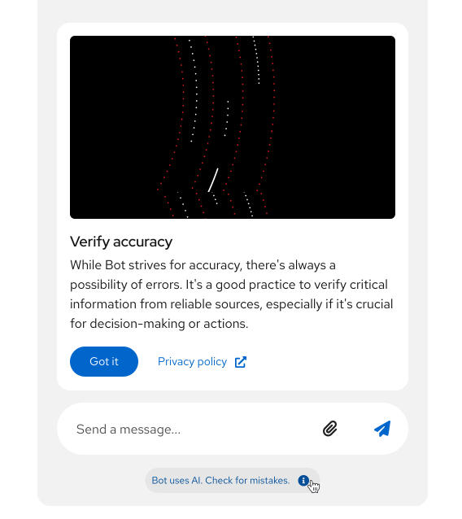
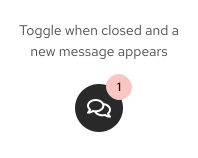
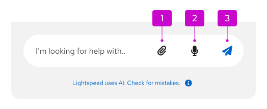

import "./images.css"

## Elements 

1. **Container:** The window that contains the entire ChatBot experience and all of its components.
1. **Header:** A persistent region at the top of the ChatBot window that contains navigation, branding, and actions.
1. **Navigation:** A menu that contains navigational options, including access to the conversation history.
1. **Messages:** Elements of the conversation between a ChatBot and user. For more details, refer to the [ChatBot message guidelines](#messages).
1. **Attachments:** Details about files that a user has uploaded to the ChatBot.
1. **Footer:** A persistent region at the bottom of the ChatBot window that contains the message bar and the footnote.
1. **Footnote (optional):** A persistent, short message that contains any legal disclaimers or important information about the ChatBot. Footnotes are optional, but strongly recommended. For more information, refer to the [ChatBot footnote guidelines](#footnotes).
1. **Toggle:** The button that allows users to open and close the ChatBot window. When the ChatBot is opened, the toggle should appear below the ChatBot window.

### Toggle 

Users can toggle a ChatBot open and closed, so that conversations can persist over time and be revisited as needed. The toggle is a floating button that's placed in the bottom corner of the UI. 

In addition to this floating button, you can place an icon in the masthead that acts as a toggle. 

### Messages 

1. **Bot message:** Messages from the ChatBot, which are marked with an "AI" label to communicate the use of AI to users. You should choose a descriptive name for your ChatBot.
1. **User message:** Messages that the user has sent to the ChatBot.
1. **Avatar:** Representative image for your ChatBot and the user. ChatBot avatars should align with your product's brand, adhering to any brand standards that exist.
1. **Name:** Identifier for your ChatBot and the user. Choose a name for your ChatBot that users can easily identify as a bot. 
1. **Label:** Labels ChatBot messages as "AI."
1. **Timestamp:** The relative or absolute time that a message was sent.
1. **Quick responses:** Programmable, clickable actions that allow users to quickly answer questions from the ChatBot.

### Footnotes 

The footnote provides a persistent space to display messaging about your product's Terms and Conditions, which focus on the rules of using the service, and Privacy Policy, which focuses on the handling of personal data.

Though footnotes are not required, they are highly recommended to ensure legal compliance, establish user trust, and clearly define the usage guidelines and data handling practices. 

When users select the footnote, you can display a popover that provides more information than would fit in the footnote:

## Usage

When ChatBots are designed to meet the needs of your users, they can improve the overall UX of your product by offering convenient, efficient, and persistent support. When your ChatBot cannot find an answer for your users, you must provide them with a method to contact human support.

Before building a ChatBot, make sure that you have justified it as an appropriate solution by asking yourself these questions:
- What are the users’ goals?
- How in-depth is the assistance the user will need?
- Does human assistance better serve your users?
- How is a ChatBot superior to online documentation, contextual support or wizards?
- What data sources or abilities can this ChatBot leverage to assist your users?

Do not create a ChatBot simply for the sake of novelty.

### When to use a ChatBot 

Use a ChatBot to offer your users on-demand help at any time, including:
- Technical support and troubleshooting.
- Product information and documentation.
- Sales and product recommendations.
- Training and onboarding.
- System monitoring and alerts.
- Community engagement .
- Feedback collection and surveys.

### When not to use a ChatBot

Do not use a ChatBot when: 
- A task could be accomplished more efficiently through the UI. 
- A process is very complex or could take a long time.
- A real human is needed for sensitive or emotional topics.

## Behavior 

### Accessing a ChatBot

Users can enter a conversation with a ChatBot by clicking on the toggle. Once the ChatBot window opens, the toggle will change to display an "angle down" icon to indicate that clicking the toggle again will minimize the ChatBot. Users can select the toggle at any point in their journey to open and close the ChatBot as needed.

When there is an unread message from the ChatBot, a notification badge should be placed on the toggle.

### Sending messages and attaching files

To message the ChatBot, users can type directly into the message bar in the footer or click any included actions. 

1. **Attach button:** Allows users to upload files from their computer. 
1. **Use microphone button:** Supports speech recognition to allow users to use voice input.
1. **Send button:** Allows users to send a typed message. This button should be disabled until a user has input text.

### Using the navigation menu

The ChatBot navigation menu primarily contains a users' conversation history with the ChatBot. Clicking the menu icon opens a side drawer in the ChatBot window. 

By clicking into the navigation menu, users can search through previous conversations and perform additional actions, such as sharing a conversation with others. 

## Variations 

There are a few display modes that users can choose when interacting with a ChatBot.

- **Overlay:** The default display mode, which places the ChatBot window on top of a product's UI. In overlay mode, the ChatBot can be closed and opened through the toggle. 

- **Docked:** Anchors the ChatBot in the UI as a side drawer. When docked, the ChatBot window is persistent, and cannot be toggled.

- **Full screen:** The ChatBot window takes up the whole screen.

- **Embedded:** The ChatBot is embedded within a product as its own page.

## Placement

Your users will expect your ChatBot to be in a reliable, permanent location. By default, this will be in the bottom right of the screen.

## Content considerations

For guidance on writing ChatBot content, refer to our [conversation design guidelines](/patternfly-ai/conversation-design).

## Accessibility 

Although accessibility has been integrated into the design of our ChatBot components, it is important to ensure that your implementation is inclusive of all users. For more guidance, refer to [our accessibility guidelines](/accessibility/about-accessibility).